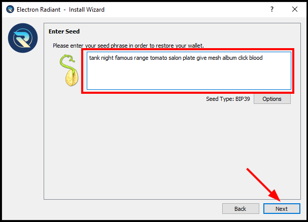
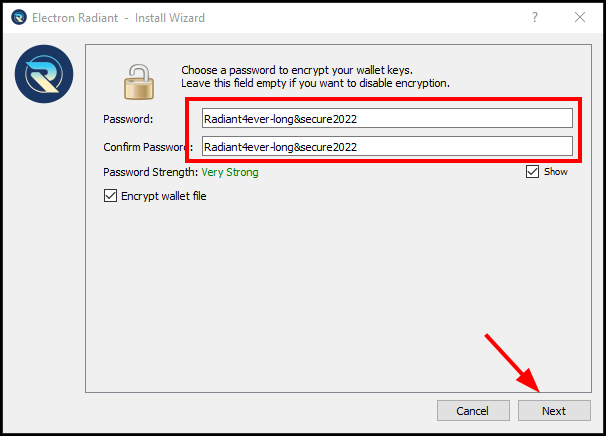
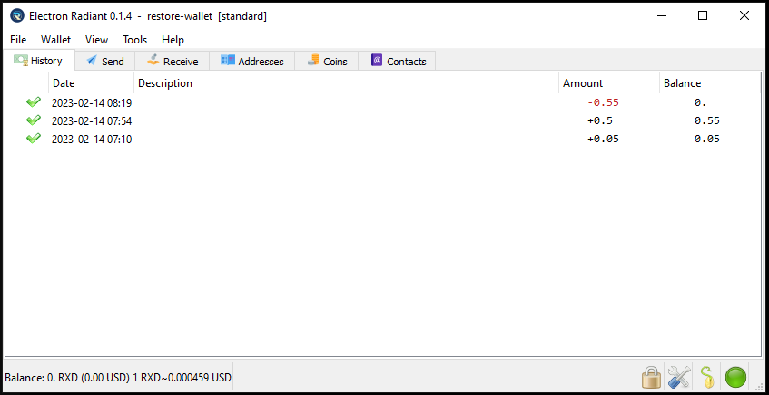

# RESTORE WALLET - ELECTRON WALLET

The Electron wallet uses BIP39 to store the wallet keys. Samara and Chainbow also use BIP39 to host these keys, making all these wallets compatible with each other.

It is very important to have these words stored securely, as without them it is not possible to retrieve the stored funds. More information about BIP39

BIP39: [https://en.bitcoin.it/wiki/Seed_phrase](https://en.bitcoin.it/wiki/Seed_phrase)

**Create new wallet**

Select a name for this restore wallet.

Select standard wallet

Specify that we already have a seed.

Write the saved seed in the box with the same saved word order.

Specify the derivation of the addresses. If it has not been changed, leave the default with: m/44'/0'/0'

Specifying a good password to the restored wallet.

Finally, the restored wallet data should be displayed on the screen.

