# PENGGUNAAN PERTAMA - DOMPET ELEKTRON

Dompet Elektron direkomendasikan untuk penggunaan penerimaan dan pengiriman secara umum. Ini menggunakan Electrumx untuk terhubung ke node Radiant.

Apa yang akan Anda lihat dalam panduan ini:

- Mengunduh Dompet
- Generasi Benih untuk dompet.
- Dasar-dasar untuk mengirim dan menerima.

## Unduh dompet

URL: [https://github.com/RadiantBlockchain/electron-radiant/releases](https://github.com/RadiantBlockchain/electron-radiant/releases)

Untuk panduan ini saya merekomendasikan versi portabel karena tidak memerlukan instalasi. Ini memungkinkan Anda untuk memindahkannya ke komputer lain atau membuat cadangan dengan cara yang sederhana.

- **MACOS:** Electron-Radiant-v0.x.x-macosx.dmg
- **WIN PORTABLE:** Electron-Radiant-v0.x.x-portable.exe
- **WIN INSTALL:** Electron-Radiant-v0.x.x-setup.exe
- **LINUX PORTABLE:** Electron-Radiant-v0.x.x-x86_64.AppImage

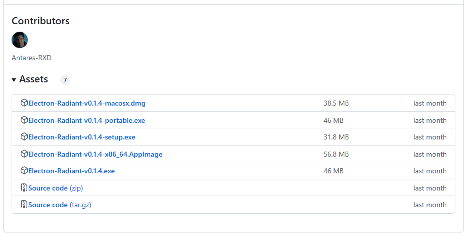

Pertama kali dijalankan, Anda harus menerima peringatan Windows. Mungkin juga antivirus mengatakan bahwa ia mungkin memiliki Trojan, tetapi itu adalah false-positive.


Dan klik di Run anyway


Dua ikon muncul dalam instalasi. Versi standar, yaitu **Mainnet** dan **Testnet**, yaitu jaringan testnet.

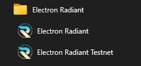


Langkah selanjutnya adalah menunjukkan cara menghubungkan dompet. Secara default sudah benar


Sekarang saatnya membuat dompet baru dan perlu diberi nama. Untuk memuat cadangan, perlu memuat file dompet


Radiant hanya berfungsi dengan dompet standar, yaitu yang dapat dihubungi. Untuk mengambil kunci pribadi tertentu, itu akan menjadi opsi 3

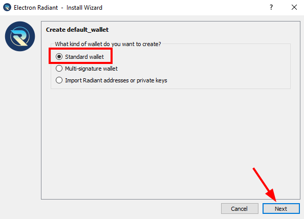

## Buat benih baru

Pada langkah selanjutnya kita memiliki dua opsi penting untuk dipilih. Pulihkan dompet dengan kata-kata yang disimpan atau buat yang baru.

Dalam hal ini kami memilih yang baru:

1. Create new seed
2. Restore seed.

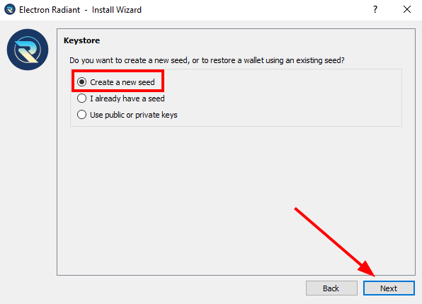

Kata-kata yang muncul akan menjadi benih portofolio baru. Perlu dan wajib untuk menuliskannya atau menyalinnya ke file. Jika hilang, Anda akan kehilangan akses ke setiap radiant di portofolio alamat.

**PENTING: BUAT BEBERAPA SALINAN CADANGAN DARI KATA INI**

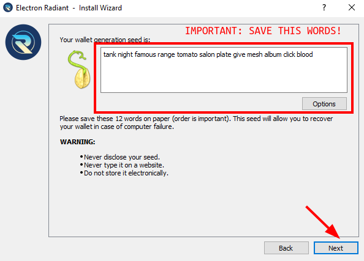

Untuk memastikan kata-kata disalin dengan benar, Anda diminta untuk memasukkan semuanya pada langkah berikut

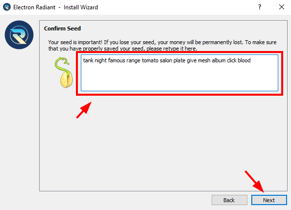

Dan langkah terakhir adalah membuat kata sandi yang mengenkripsi dompet.

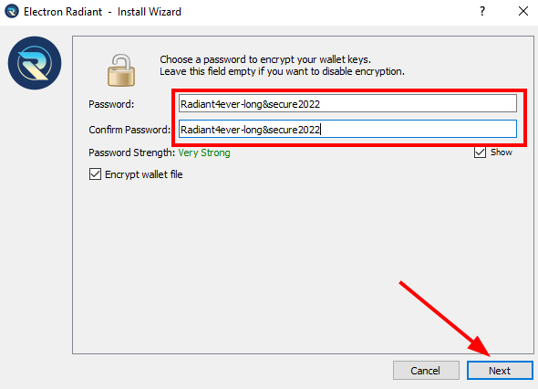

## Opsi TAB

| TAB | Description |
| ------ | ------ |
| 1. History | All transactions from all addresses |
| 2. Send | To send coins to an address |
| 3. Receive | Address to receive coins and it will always be an unused one. |
| 4. Addresses | The first 20 seed directions. All are valid for receiving and sending |
| 5. Coins | The UTXO of each reception |
| 6. Contacts | Addresses targeted for reuse |


### Riwayat

1. Status of TX.
2. Transaction date.
3. Address label.
4. Amount of RXD of the transaction.
5. Overall balance of the transaction.


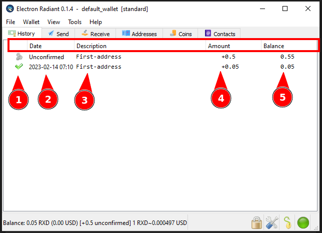

### Kirim

1. Destination address
2. Name of the address.
3. Send button.
4. Bar to establish network commission.
5. Amount to send


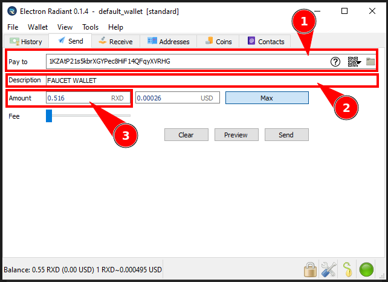

Jika Anda telah memasukkan kata sandi di dompet, Anda harus memasukkannya untuk melakukan transaksi.

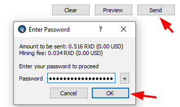

Setelah semuanya diisi dengan benar, transaksi ditampilkan.


Pada history muncul transaksi ini seperti terlihat pada gambar dan transaksi akan muncul pada blok berikutnya yang dihasilkan (sekitar 5 menit).

1. Coin input
2. Coin output


### Menrima

Alamat tidak digunakan untuk menerima dana baru

1. alamatnya akan selalu menjadi alamat yang tidak pernah menerima dana.
2. Nama yang akan ditambahkan ke alamat

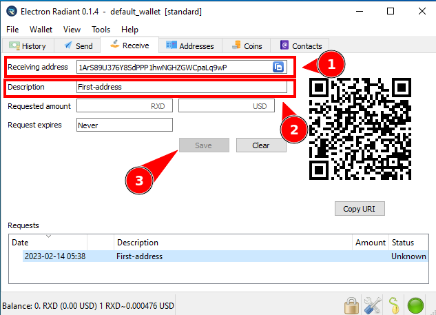

### Alamat-Alamat

20 alamat pertama dompet dan jumlah koin di masing-masingnya. Dalam perubahan

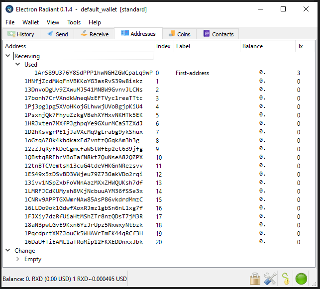

### Koin

**Di sini Anda dapat melihat semua transaksi yang diterima dan tidak dibelanjakan.**

1. Addresses to receive
2. Number of coins per address


Jika tombol konektivitas berwarna merah, Anda dapat memperbaikinya dengan mengkliknya dan memeriksa server tempat Anda terhubung.


Di server semua server dimuat dan dapat ditambahkan jika perlu.


Berikut adalah server yang dapat Anda sambungkan


 
**SERVER SEBENARNYA**
```
electrumx.radiant.ovh 50012
electrumx.radiantexplorer.com 50012
electrumx2.radiantexplorer.com 50012
electrumx.radiantblockchain.org 50012
electrumx.radiant4people.com 50012
```